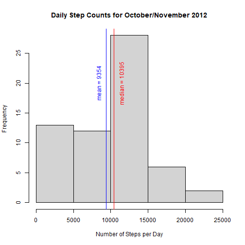
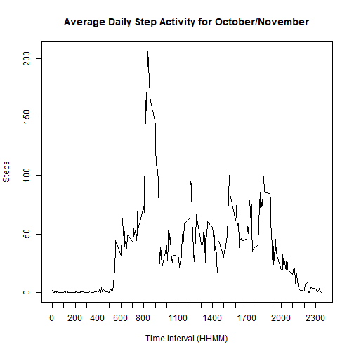
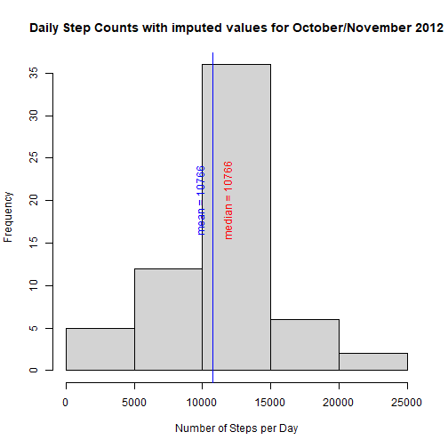
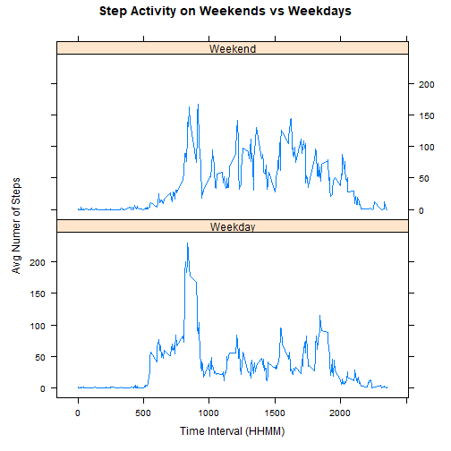

## Loading and preprocessing the data
Unzip and read data located in the 'activity.zip' file located in the root
directory or available [here][1].

Date values are initially stored as character vectors and must be converted to
date objects.

```r
data <- read.csv(unzip('activity.zip'))
data$date <- as.Date(data$date, '%Y-%m-%d')
```


## What is mean total number of steps taken per day?
With the data loaded, we can begin analyzing. First, we load the dplyr package   
so we can aggregate and sum across the date. This value is stored in a new table  
called 'dailystepsum'. 'NA' steps values are ignored using the na.rm argument  
in the sum function. We then calculate the median and mean values of the daily  
step counts using this new table.  

```r
library(dplyr)
library(rmarkdown)
dailystepsum <- data %>% 
              group_by(date) %>% 
              summarize(total = sum(steps, na.rm = TRUE))
median <- median(dailystepsum$total)
mean <- round(mean(dailystepsum$total), 0)
print(head(dailystepsum))
```

```
## # A tibble: 6 x 2
##   date       total
##   <date>     <int>
## 1 2012-10-01     0
## 2 2012-10-02   126
## 3 2012-10-03 11352
## 4 2012-10-04 12116
## 5 2012-10-05 13294
## 6 2012-10-06 15420
```
We then create a histogram using daily step counts. Vertical lines for the mean  
and median values are plotted on the histogram as well.        

```r
hist(dailystepsum$total,
     xlab = 'Number of Steps per Day',
     main = 'Daily Step Counts for October/November 2012')
abline(v = median, col = 'red')
abline(v = mean, col = 'blue')
text(x = c(median + 1000, mean - 1000), 
     y = 20, 
     labels = c(paste('median =', median), paste('mean =', mean)), 
     col = c('red', 'blue'),
     srt = 90)
```



## What is the average daily activity pattern?

This time, we regroup the data by the time interval and average across all the  
days in the period. The value for the max average steps occurs at the interval  
835 with a value of 206.  

```r
dailypattern <- data %>%
                group_by(interval) %>%
                summarize(avgsteps = mean(steps, na.rm = TRUE))

maxindex <- which.max(dailypattern$avgsteps)
dailypattern[maxindex, ]
```

```
## # A tibble: 1 x 2
##   interval avgsteps
##      <int>    <dbl>
## 1      835     206.
```
The results are plotted as a line graph.  

```r
with(dailypattern, plot(interval, 
                        avgsteps, 
                        type = 'l',
                        main = 'Average Daily Step Activity for October/November',
                        xaxt = 'n',
                        ylab = 'Steps',
                        xlab = 'Time Interval (HHMM)'))
axis(1, at = seq(0, 2400, by = 100))
```



## Imputing missing values
Calculate number of missing values by summing the logical vector is.na().

```r
sum(is.na(data$steps))
```

```
## [1] 2304
```
Replace the missing values with with mean value for that interval and create a  
new set with the missing values filled in.  

```r
imputed <- data
imputedtemp <- left_join(imputed, dailypattern, by = 'interval')
imputedtemp$steps <- as.numeric(imputedtemp$steps)
imputed$steps <- with(imputedtemp, 
                      if_else(is.na(imputedtemp$steps), avgsteps, steps))
```
Recalculate the daily steps sums, but this time using the dataset with imputed  
values.

```r
imputedsum <- imputed %>% 
                group_by(date) %>% 
                summarize(total = sum(steps, na.rm = TRUE))
median <- round(median(imputedsum$total),0)
mean <- round(mean(imputedsum$total), 0)
```
Generate histogram using new dataset.

```r
hist(imputedsum$total,
     xlab = 'Number of Steps per Day',
     main = 'Daily Step Counts with imputed values for October/November 2012')
abline(v = median, col = 'red')
abline(v = mean, col = 'blue')
text(x = c(median + 1000, mean - 1000), 
     y = 20, 
     labels = c(paste('median =', median), paste('mean =', mean)), 
     col = c('red', 'blue'),
     srt = 90)
```


Replacing missing values with the mean of the interval results in both higher  
means and medians for the set. Also, the mean equals the median.

## Are there differences in activity patterns between weekdays and weekends?
Create new column in data with value equal to Weekend or Weekday, depending on  
the value contained in the date field.

```r
imputed$weekday <- ifelse(weekdays(imputed$date) == 'Saturday' | weekdays(imputed$date) == 'Sunday', 
                       'Weekend', # value if True
                       'Weekday') #value if False
```
Generate a panel plot comparing the step activity on weekends vs weekdays.  

```r
library(lattice)
weekdaysteps <- imputed %>%
                group_by(interval, weekday) %>%
                summarize(avg = mean(steps))

xyplot(avg ~ interval | weekday, 
       weekdaysteps, 
       type = 'l', 
       layout = c(1, 2),
       main = 'Step Activity on Weekends vs Weekdays',
       ylab = 'Avg Numer of Steps',
       xlab = 'Time Interval (HHMM)')
```



[1]: https://d396qusza40orc.cloudfront.net/repdata%2Fdata%2Factivity.zip
